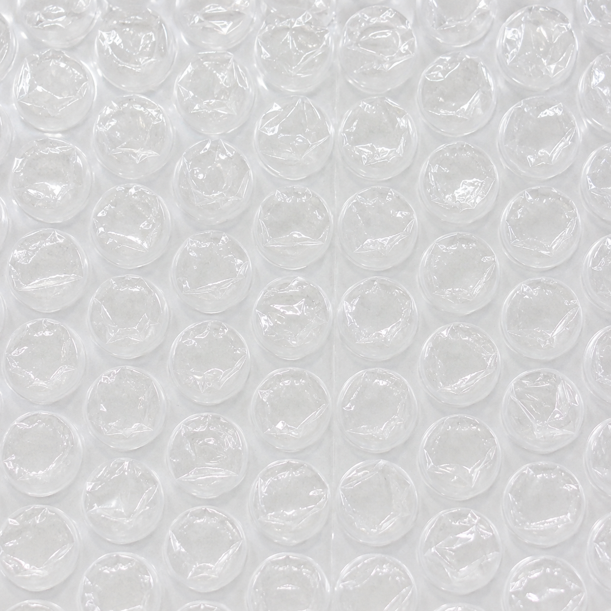

# 🫧 디지털 무한 뽁뽁이 (Bubble Wrap)

> 아무 생각 없이 톡! 톡! 터뜨려보세요.

파스텔톤의 무한 뽁뽁이 웹페이지입니다. 클릭하거나 마우스로 슥 문지르면 뽁뽁이가 주르륵 터지고, 경쾌한 "뽁!" 소리와 함께 파스텔 입자가 팡 하고 흩어집니다.

빌드 도구도, 의존성도, 서버도 없습니다. **`index.html` 파일 하나가 전부**입니다.



## 시작하기

파일을 브라우저로 열기만 하면 됩니다.

```bash
open index.html          # macOS
xdg-open index.html      # Linux
start index.html         # Windows
```

로컬 서버가 필요하다면 (예: 모바일 기기에서 접속해 터치 동작을 확인할 때):

```bash
python3 -m http.server 8000
# → http://localhost:8000
```

## 기능

| 기능          | 설명                                                                            |
| ------------- | ------------------------------------------------------------------------------- |
| 클릭 & 드래그 | 클릭 한 번에 한 알, 누른 채 문지르면 지나간 자리가 연속으로 터집니다            |
| 사운드        | Web Audio API로 실시간 합성 — 오디오 파일 없음                                  |
| 파티클        | 터진 자리에서 파스텔 입자가 사방으로 튀었다가 사라집니다                        |
| 카운터        | 오늘 터뜨린 갯수를 LocalStorage에 저장 (새로고침해도 유지, 날짜가 바뀌면 0부터) |
| 리셋          | "새 뽁뽁이 가져오기" 버튼으로 판 전체를 새것으로                                |
| 반응형        | 화면 크기에 맞춰 알갱이 개수를 자동으로 채웁니다                                |
| 음소거        | 좌측 상단 🔊 토글                                                               |
| 접근성        | Tab + Enter/Space로도 터뜨릴 수 있고, `prefers-reduced-motion`을 존중합니다     |

## 구현 노트

**드래그 타격감** — 터치 환경에서는 암묵적 포인터 캡처 때문에 `pointerenter`가 발생하지 않습니다. 그래서 이벤트 타깃 대신 좌표 기반 `document.elementFromPoint()`로 마우스와 터치를 한 경로에서 처리합니다. 여기에 이전 프레임 좌표와 현재 좌표 사이를 셀 크기의 절반 간격으로 보간해서, 마우스를 빠르게 휙 그어도 중간 알갱이가 건너뛰어지지 않습니다. 처리 자체는 `requestAnimationFrame`으로 프레임당 한 번만 실행됩니다.

**사운드 합성** — 외부 오디오 파일 없이 두 레이어를 겹칩니다. 몸통은 위로 튀어오르는 피치 스윕(triangle/sine 오실레이터), 어택은 밴드패스를 통과한 30ms 노이즈 버스트로 비닐이 찢어지는 질감을 냅니다. 매번 380~680Hz 사이에서 음높이·길이·필터 주파수를 랜덤화해 반복해도 지루하지 않습니다. 동시에 여러 알이 터질 때의 클리핑은 `DynamicsCompressor`로 잡았습니다. 노이즈 버퍼는 한 번만 만들어 재사용합니다.

**리사이즈 시 상태 보존** — 창 크기가 바뀌면 판을 다시 만드는 게 아니라 알갱이 개수만 가감합니다. 앞쪽 인덱스의 DOM이 그대로 남으므로, 이미 터뜨린 알갱이가 되살아나지 않습니다.

**성능** — 파티클은 Web Animations API로 돌리고 동시 260개로 제한해, 드래그로 폭주시켜도 프레임이 무너지지 않습니다. 카운터의 LocalStorage 쓰기는 250ms 디바운스하고, 탭이 닫힐 때(`pagehide`) 확정 저장합니다.

**브라우저 정책** — 소리는 사용자의 첫 인터랙션 이후부터 재생됩니다. AudioContext는 그 시점에 생성·resume됩니다.

## 커스터마이징

`index.html` 상단의 값만 바꾸면 됩니다.

```css
:root {
	--cell: 44px; /* 알갱이 크기 — 작을수록 촘촘해집니다 */
	--gap: 9px; /* 알갱이 간격 */
}
```

```js
const PASTELS = ['#a8e6d8', '#b8d9f5', '#f9c9dd', ...];  // 파티클 색상
const MAX_PARTICLES = 260;                                // 동시 파티클 상한
```

소리 톤은 `playPop()`의 `pitch` 기준값(380 + 랜덤 300)을 조절하세요. 값을 올리면 더 높고 앙증맞은 소리가, 내리면 묵직한 소리가 납니다.

## 배포

정적 파일 하나뿐이라 어디든 그대로 올라갑니다 (Vercel, Netlify, GitHub Pages 등).

## 브라우저 지원

Chrome, Edge, Safari, Firefox 최신 버전. Pointer Events, Web Audio API, Web Animations API, `ResizeObserver`, `backdrop-filter`를 사용합니다.

폰트는 구글 폰트(Jua, Gaegu)를 불러오지만, 로드에 실패해도 시스템 한글 폰트로 폴백되므로 오프라인에서도 정상 동작합니다.
